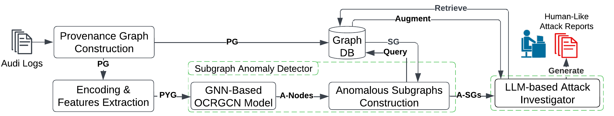

# OCR-APT
OCR-APT is an APT detection system capable of identifying anomalous nodes and subgraphs, performing alerts triage based on abnormality levels, and recovering attack stories to support comprehensive attack investigation.
OCR-APT employs GNN-based subgraph anomaly detection to identify suspicious activities and utilizes LLMs to generate human-like attack reports.  
This is the repository of the submitted paper: **OCR-APT: Reconstructing APT Stories through Subgraph Anomaly Detection and LLMs.**

## Repository Roadmap
The input to the system are kernel audit logs in a csv format.
The system consist of multiple python scripts and other bash script to command them in an interactive way.
- `/src` directory holds all python scripts.
- `/bash_src` directory holds all bash scripts.
- `/recovered_reports` directory contains all recovered reports in our experiments.
- `/groundtruth` directory contains the ground truth labels, each file contains malicious nodes UUID in a specific dataset/host. It should be moved to the dataset directory for reproducing results
- `/logs` directory is the default location for all generated system logs
- `/dataset` directory is the default location for training and testing audit logs, ground truth labels, experiments checkpoints, trained GNN models and results. Results include detected anomalous nodes and subgraphs, and recovered attack reports.

## OCR-APT system Architecture 

## Experiments with locally deployed LLMs
### **Experiment Summary** 
We evaluated OCR-APT using a locally deployed language model and compared its generated reports with those produced by ChatGPT. Specifically, we deployed **LLAMA3 (8B parameters)** on a machine with 4 CPU cores, an 8GB GPU, and 22GB of RAM.  
To optimize performance, we experimented with different local embedding models, analyzing their outputs to determine the most effective one.  
Our findings show that **LLAMA3, when paired with the best-performing embedding model, produced reports of comparable quality to ChatGPT**.  

Detailed experiment results are available in this [spreadsheet](Experiments_with_locally_deployed_LLMs.xlsx).  